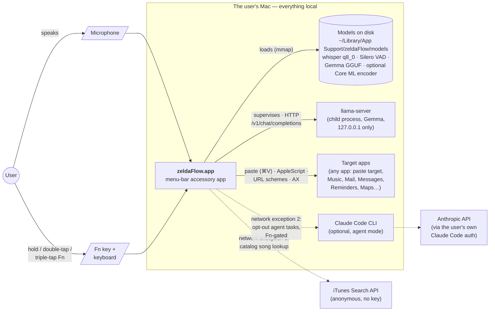
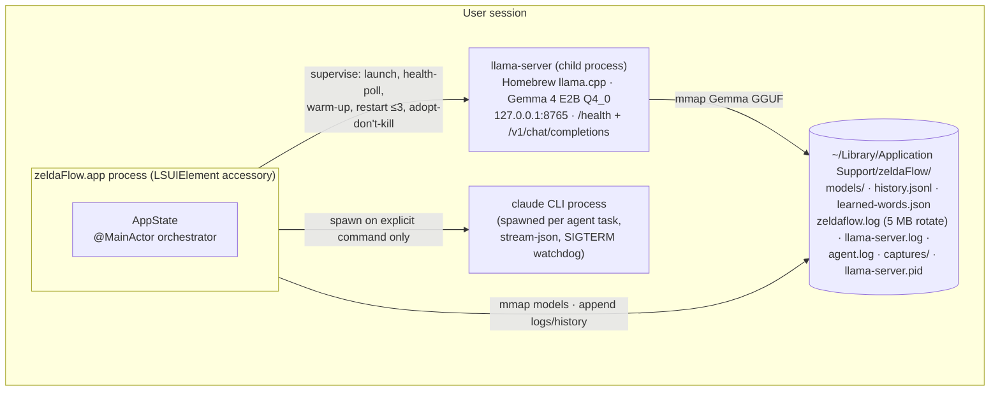
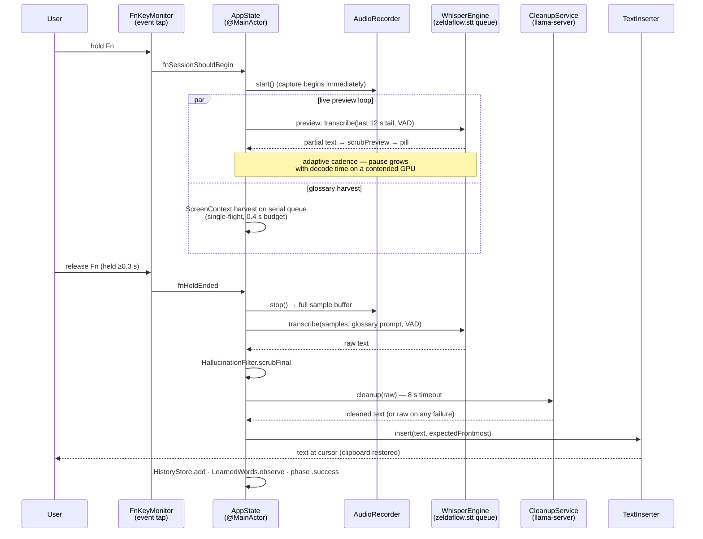
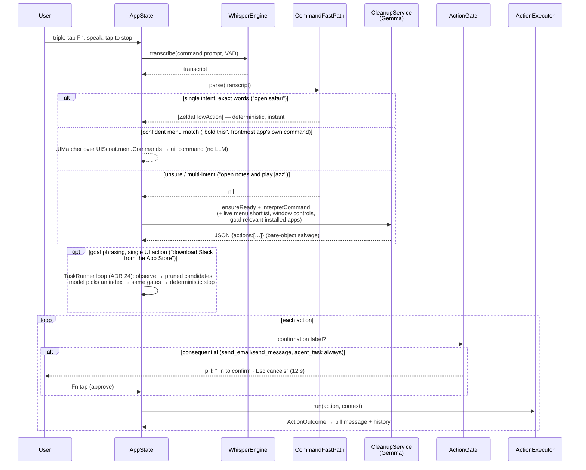
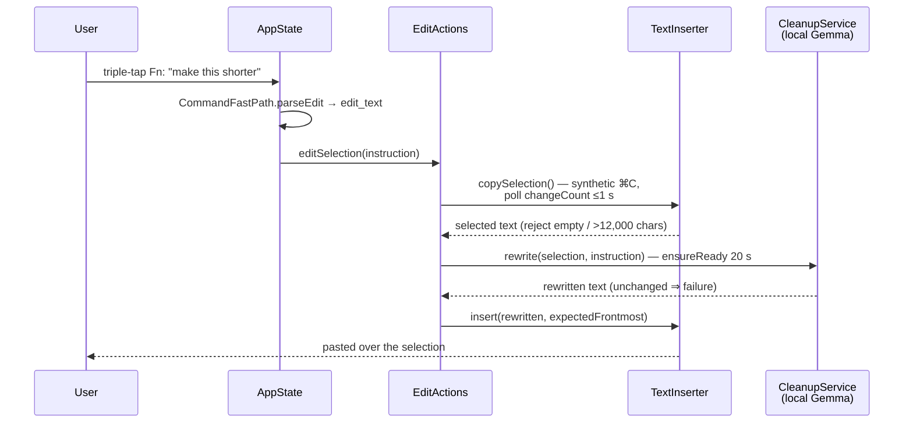

# zeldaFlow Architecture

A lightweight [arc42](https://arc42.org)-shaped architecture document for zeldaFlow, zeldaLabs' local-first voice dictation and voice-command app for macOS. Diagrams follow the [C4 model](https://c4model.com) (context → containers → components) and render natively on GitHub via mermaid.

---

## 1. Introduction & Goals

zeldaFlow is a native Swift (AppKit + SwiftUI) menu-bar app that turns speech into text anywhere on a Mac — hold the **Fn/Globe** key, talk, release, and the transcript lands at your cursor. A triple-tap turns the same key into a voice-command channel ("open Safari", "play Fleetwood Mac", "make this shorter"). Everything runs on-device: whisper.cpp (large-v3-turbo) on Metal/ANE for speech-to-text, Silero VAD for silence filtering, and a local llama-server running Gemma for transcript cleanup and command parsing.

**Quality goals, in priority order:**

| # | Goal | What it means concretely |
|---|------|--------------------------|
| 1 | **Privacy / local-first** | Dictation audio and transcripts never leave the Mac. No cloud, no account, no subscription. The two network exceptions (§3) are bounded, named, and gated. |
| 2 | **Latency** | Sub-second final transcription after key release for short utterances; greedy decoding with no fallback re-decodes so latency is bounded, not just fast on average (measured numbers in §10). |
| 3 | **Robustness** | Degrade honestly, never silently: cleanup failure falls back to the raw transcript, a missing app falls back to its web version, an unresolvable email recipient becomes a visible draft — and consequential actions (send email/message, background agent) sit behind an explicit Fn-tap confirmation. |

## 2. Constraints

| Constraint | Consequence |
|---|---|
| **Apple Silicon only, macOS 15+** | Build targets `arm64-apple-macos15.0`; whisper and Gemma run on Metal. `build-app.sh` and `setup.sh` gate on `sysctl hw.optional.arm64` (hardware, not process arch — a Rosetta shell lies). |
| **TCC permissions** | Accessibility (event tap + synthetic ⌘V), Microphone, per-app Automation, optionally Screen Recording. Grants are keyed to the code signature, bundle ID, and install path — all three are kept stable (§7). |
| **No Xcode project — SwiftPM manifest + direct `swiftc`** | The macOS 27 beta Command Line Tools ship a `PackageDescription` whose swiftinterface and dylib disagree, so **any** `Package.swift` fails to compile. `scripts/build-app.sh` compiles all sources in one `swiftc` invocation and assembles the `.app` by hand; `Package.swift` is kept dormant for when Apple fixes the toolchain. |
| **Beta-CLT quirks** | No `SwiftUIMacros` plugin, so `@State` is unavailable — the UI uses small `@StateObject` `ObservableObject` models and drives all continuous animation from `TimelineView` time. SwiftUI `TextField` doesn't deliver keystrokes to its binding on this beta; `AppKitTextField` wraps `NSTextField` instead. |
| **Swift 5 language mode** | Strict-concurrency findings stay warnings, not errors (accepted debt, §11). |
| **External runtime dependencies are optional** | Homebrew `llama.cpp` (cleanup + LLM command parsing) and the Claude Code CLI (agent mode) are discovered at runtime; their absence degrades features, never breaks dictation. |

## 3. System Context (C4 level 1)



Dictation audio and transcripts stay inside the box. The two dotted arrows are the only network paths, and both are bounded:

1. **Apple Music catalog lookup** — an anonymous, key-less query to the public iTunes Search API, used only when the user asks to play a song that isn't in their library.
2. **Claude agent mode** — screen analysis and background tasks bridge to the locally installed Claude Code CLI. On by default but can be turned off in the menu (off ⇒ fully local, always); every background task additionally requires a Fn-tap confirmation with no setting to disable it. Absent CLI ⇒ disabled menu item.

Web questions don't answer in-app over the network: they either get an offline instant answer from the local model or open a Google search in the user's default browser.

## 4. Solution Strategy

- **In-process whisper, out-of-process Gemma.** whisper.cpp links in-process (vendored XCFramework, no IPC latency, one resident Metal context); the much larger Gemma model runs behind a supervised `llama-server` child so its crashes are isolated and an already-running server can be adopted rather than fought over.
- **Deterministic before probabilistic.** A hand-written fast-path parser handles common single-intent commands from the user's exact words; only unmatched phrasing falls through to the local LLM. The LLM outputs **structured JSON actions, never code** — hand-written AppleScript templates (argv, no shell) do the actual work.
- **Humans at the approval gates, not in the loop.** Dictation is friction-free; send-email/send-message and every agent task require a Fn-tap confirmation. Learned dictionary words require explicit approval in the Hub, never an interrupting prompt.
- **Layered anti-hallucination.** Silero VAD keeps silence away from the decoder; `no_speech` thresholds drop non-speech segments; a text scrubber with asymmetric strictness cleans caption junk (aggressive on the display-only preview, ultra-conservative on the final transcript, because a false drop there is silent data loss).
- **One key, four gestures.** A suppressing CGEventTap multiplexes hold (push-to-talk), double-tap (hands-free), triple-tap (command mode), and bare tap (confirmation approval) on Fn — swallowing the event before macOS's own globe action fires.
- **Non-activating UI.** The pill HUD is a borderless `NSPanel` that never steals focus from the paste target; the click-to-type command bar takes key without activating zeldaFlow, Spotlight-style.

## 5. Building Block View

### 5.1 Containers (C4 level 2)



### 5.2 Components inside the app (C4 level 3)

```mermaid
flowchart TB
    subgraph hotkey["Hotkey"]
        fn["FnKeyMonitor<br/>suppressing CGEventTap,<br/>gesture state machine, watchdog"]
    end

    appstate["<b>AppState</b> (@MainActor)<br/>phase state machine · session generations ·<br/>pipelines · confirmation gate"]

    subgraph audiostt["Audio / STT"]
        rec["AudioRecorder<br/>AVAudioEngine → 16 kHz mono Float32"]
        whisper["WhisperEngine<br/>whisper.cpp, serial 'zeldaflow.stt' queue"]
        halluc["HallucinationFilter<br/>preview (aggressive) / final (conservative)"]
        sctx["ScreenContext<br/>bounded AX harvest → glossary terms"]
    end

    subgraph cmd["Command pipeline"]
        fast["CommandFastPath<br/>deterministic parser"]
        cleanup["CleanupService<br/>llama-server supervisor · cleanup ·<br/>interpretCommand · rewrite · instantAnswer"]
        exec["ActionExecutor + ActionGate<br/>→ Actions+Basic/Edit/Comms/Agent/UI/Files,<br/>AppResolver, MusicPlayer, AppleMusicCatalog,<br/>AppleScriptRunner, WebAnswer"]
        uiscout["UIScout · UIControls · UIMatcher<br/>app-declared menus + window controls (AX)"]
    end

    subgraph task["Task loop"]
        taskloop["TaskRunner · TaskCandidates ·<br/>TaskObservation · TaskIntent<br/>observe → pruned options → model picks index"]
    end

    subgraph meeting["Meeting notetaker"]
        mcen["<b>MeetingCenter</b> (@MainActor)<br/>parallel ambient state · banners ·<br/>crash-recovery sweep"]
        mdet["MeetingDetectionEngine<br/>MicActivityMonitor · MeetingProcessMonitor ·<br/>BrowserMeetingProbe · MeetingApps"]
        mrec["MeetingRecorder<br/>AudioRecorder (mic, ADR 26) + SystemAudioTap<br/>WavSpool spools · MicLoan"]
        msess["MeetingSession + MeetingTranscriber<br/>MicHoldback · TranscriptMatcher ·<br/>SystemActivityTracker"]
        mnote["MeetingNotesGenerator<br/>map-reduce over llama-server"]
        mstore["MeetingStore (JSONL folders)<br/>MeetingExporter"]
    end

    subgraph ui["UI layer"]
        pill["PillPanel/PillView<br/>non-activating HUD + type bar +<br/>meeting chip/banner"]
        hub["MainWindow (Hub)<br/>Home · History · Meetings · Dictionary · Settings"]
        bar["StatusBarController"]
        onb["Onboarding (cinematic)"]
    end

    subgraph insert["Insert"]
        ins["TextInserter (async)<br/>clipboard save/restore + synthetic ⌘V"]
        md["MarkdownRenderer → RTF/HTML"]
    end

    subgraph support["Support / lifecycle"]
        sup["AppSettings · Paths · Log · Permissions ·<br/>HistoryStore · LearnedWords · LoginItem ·<br/>SelfTest · CommandEvals"]
        agent["AgentService + ScreenCapture<br/>(Claude CLI bridge)"]
    end

    fn --> appstate
    appstate --> rec --> whisper --> halluc
    appstate --> sctx
    appstate --> fast
    fast -. "nil = unsure" .-> cleanup
    appstate --> cleanup
    appstate --> exec
    appstate --> taskloop
    taskloop --> exec
    exec --> uiscout
    exec --> agent
    exec --> ins
    appstate --> ins
    ins --> md
    appstate <--> mcen
    mcen --> mdet
    mcen --> mrec
    mrec --> msess
    msess --> whisper
    msess --> mstore
    mcen --> mnote
    mnote --> cleanup
    mrec -. "mic loan" .-> appstate
    mcen <--> pill
    appstate <--> pill
    appstate <--> bar
    appstate <--> hub
    appstate <--> onb
    appstate --> sup
```



Responsibilities in one line each:

| Block | Responsibility |
|---|---|
| **Audio/STT** | Mic capture (persistent `AVAudioEngine`, on-the-fly resample, explicit channel map for the multichannel VPIO stream), in-process whisper.cpp with Silero VAD pre-filter, caption-hallucination scrubbing, and on-screen glossary harvesting to bias spellings. |
| **Command pipeline** | Transcript → `[ZeldaFlowAction]` (fast path first, then a confident menu match, then Gemma) → confirmation gate → hand-written executors (AppleScript/NSWorkspace/URL schemes/AX). The LLM only fills parameters. `UIScout`/`UIControls`/`UIMatcher` expose any app's own menus and window controls (ADR 23); `Actions+Files` covers spoken file operations, Trash-only. |
| **Task loop** | Goal-shaped commands ("download Slack from the App Store") run `TaskRunner` (ADR 24): observe the frontmost app, build a pruned candidate list, let the local model pick one index under a JSON schema, execute through the same gates, stop deterministically. |
| **Meeting notetaker** | Auto-detects a meeting (per-process mic attribution + known-app/browser-title corroboration), records mic ("You") + a global-except-self system-audio tap ("Them"), transcribes both on a 5 s cadence that yields to dictation with text-domain echo dedup, spools crash-safe JSONL, and writes map-reduce notes on the local LLM (ADRs 27/29/30). `MeetingCenter` is deliberately parallel to `AppState.Phase` — a 45-minute ambient state coexisting with dozens of dictations — and lends its mic stream to mid-meeting dictation via `MicLoan`. |
| **UI layer** | Floating pill (waveform, live preview, confirm badge, type bar, meeting chip + banners), menu-bar item (`record.circle` while a meeting records), Hub dashboard incl. the Meetings page/detail (`MeetingsPage`, `MeetingDetailView`, `MeetingTranscriptView`, `MeetingPillChip`), animated onboarding. A thin observer of `AppState`/`AppSettings`/`MeetingCenter`; all real work delegates back. |
| **Insert** | Clipboard snapshot → transient-marked write (+RTF/HTML for markdown-shaped text) → synthetic ⌘V → conditional restore. Refuses to paste when focus moved or secure input is active. |
| **Support** | Settings, paths + login-shell PATH discovery, private logging, TCC facade, history/stats, learned-words dictionary, launch-at-login, CLI self-tests, and the Claude CLI bridge. |

## 6. Runtime View

### 6.1 Push-to-talk dictation (Fn press → paste)



### 6.2 Voice command: fast path vs LLM (triple-tap)



### 6.3 Speak-to-Edit ("make this shorter")



## 7. Deployment View

```
git clone … && scripts/install.sh
        │
        ├── scripts/setup.sh          (idempotent; re-run repairs partial setups)
        │     ├─ Apple Silicon gate (sysctl hw.optional.arm64)
        │     ├─ brew install llama.cpp      — only if llama-server absent; skipped
        │     │                               with an explanation if brew is missing
        │     └─ model downloads → ~/Library/Application Support/zeldaFlow/models/
        │          ggml-large-v3-turbo-q8_0.bin   (874 MB, Whisper)
        │          ggml-silero-v6.2.0.bin         (1 MB, VAD)
        │          gemma-4-E2B-it-Q4_0.gguf       (2.8 GB, cleanup/commands)
        │          ggml-large-v3-turbo-encoder.mlmodelc  (1.1 GB, OPTIONAL —
        │            runs Whisper's encoder on the Neural Engine instead of the
        │            GPU; matters most with external monitors, where the GPU is
        │            also compositing. Metal fallback works without it.)
        │          (curl -fL --retry 3 -C - → .part + atomic rename)
        │
        ├── scripts/build-app.sh release
        │     ├─ one swiftc invocation over all sources
        │     │    (-swift-version 5, -target arm64-apple-macos15.0)
        │     ├─ assemble build/zeldaFlow.app (Info.plist, whisper.framework
        │     │    embedded into Contents/Frameworks)
        │     └─ codesign: $ZELDAFLOW_SIGN_ID → "zeldaFlow Dev" cert → ad-hoc "-"
        │
        └── pkill -x zeldaFlow; ditto → /Applications/zeldaFlow.app; open
```

**Why the signing dance matters:** macOS keys TCC grants to the code signature. Ad-hoc signatures change every build, so each rebuild silently loses Accessibility/Microphone/Automation — fatal for an app whose hotkey *is* an Accessibility-dependent event tap. `scripts/make-cert.sh` creates a stable self-signed "zeldaFlow Dev" certificate (10-year, imported into the login keychain; one manual Always-Trust step in Keychain Access that macOS refuses to automate). Together with the fixed bundle ID `com.zeldalabs.zeldaflow` and the stable `/Applications/zeldaFlow.app` path, grants survive rebuilds. `install.sh` uses `pkill`, not AppleScript, to quit a running instance — a pending Automation prompt makes `osascript` hang indefinitely.

**Verification loop** (no mic, no network, no permissions):

```sh
./build/zeldaFlow.app/Contents/MacOS/zeldaFlow --selftest /tmp/t.aiff   # STT + cleanup + timings
./build/zeldaFlow.app/Contents/MacOS/zeldaFlow --evalcommands           # parser + confirmation-gate pins, <1 s
```

The evals are release gates: they pin what common phrasings mean and that `agent_task` is *always* confirmation-gated regardless of settings.

## 8. Cross-cutting Concepts

### 8.1 Concurrency model

- **MainActor orchestration.** `AppState` and `FnKeyMonitor` are `@MainActor`; the event-tap callback runs on the main run loop (`MainActor.assumeIsolated`) and must stay well under the ~1 s tap timeout. An incrementing `sessionGeneration` guards every async completion so a stale pipeline can never clobber a newer session's phase.
- **Serial whisper queue.** All whisper.cpp inference is confined to the private `zeldaflow.stt` queue — whisper contexts are not safe for concurrent `whisper_full` — so live-preview decodes and the final pass naturally serialize. The preview loop uses an **adaptive cadence** (pause ≈ 1.5× the last decode time, clamped 0.15–1.5 s) so a contended GPU isn't compounded by the preview itself.
- **Serial screen-context queue.** AX harvesting runs on a dedicated `zeldaflow.screen-context` serial queue — never the Swift cooperative pool, which a handful of stuck mach-IPC walks could starve — with a single-flight guard (a still-running harvest means the target app is slow; the new session just goes without biasing terms), a per-element `AXUIElementSetMessagingTimeout` of 0.25 s (deliberately scoped to the harvest's own element refs — other AX consumers like Music.app UI driving keep macOS's ~6 s default), and a 0.4 s wall-clock budget.
- **Async TextInserter.** All paste sequencing uses suspending `Task.sleep`, never `Thread.sleep`: the tap's run-loop source lives on the main thread, and macOS disables a tap whose callback goes unserviced — a blocking sleep while pasting was enough to kill the hotkey under load.
- **Serial cleanup queue.** `CleanupService` confines all supervisor state to `zeldaflow.cleanup`; LLM HTTP requests serialize there (8 s dictation timeout, 60 s command timeout) and cleanup always falls back to raw text.

### 8.2 Privacy model

- STT, VAD, cleanup, and command interpretation are all on-device; the two network exceptions are enumerated in §3.
- `os_log` uses `privacy: .private` so spoken words never leak into the shared unified log; the app's own rotating file log keeps full text locally for debugging.
- Screen-context terms are session-scoped and discarded at session end; media apps are never harvested; zeldaFlow's own windows are excluded.
- Agent screenshots are deleted immediately after analysis (plus a launch-time sweep for crash strays); the agent audit log records the narrative but never tool results, so screenshots and secrets are never persisted.
- Clipboard writes carry the `org.nspasteboard.TransientType` marker so clipboard managers skip them, and the previous clipboard is restored.

### 8.3 Display-reconfiguration resilience

Multi-monitor setups (dock/undock, rearrange) rebase global coordinates and can strand windows on displays that no longer exist. zeldaFlow handles this at four points:

- `PillController` observes `NSApplication.didChangeScreenParametersNotification` and re-anchors the pill on every topology change; the panel clamps its origin inside the target screen (borderless panels skip AppKit's constrain pass) and retries once if the screen list is momentarily empty mid-handshake.
- The pill is **sticky**: it remembers its display and changes screens only when a recording starts on a different display (feedback belongs where dictated text will land) or when its own display disappears — never because the type bar opened, a phase changed, or an unrelated monitor came or went. The frontmost window's screen is resolved via the window server (`CGWindowListCopyWindowInfo`), never AX — a beachballing app can't stall the main thread.
- The Hub window re-centers whenever its remembered frame intersects no live screen (macOS only migrates windows that are on-screen at disconnect time).
- `AudioRecorder` marks the engine for reset when the audio topology changes while idle (a dock's HDMI/USB audio can become the default input), logs the capturing device name per session, and logs an explicit error when a capture ran but peaked at silence — the classic docked-monitor "it's not recording" failure, previously invisible.

### 8.4 Observability

- `zeldaflow.log` — rotating 5 MB file log (rotate, don't truncate: the tail of a long session is what debugging needs); per-session lines include the input device and discarded-session evidence.
- `llama-server.log`, `agent.log` — child-process and agent audit trails.
- `history.jsonl` — per-dictation timing metadata (audio seconds, transcribe ms, cleanup ms) surfaced in the Hub.
- `--selftest` and `--evalcommands` — headless end-to-end and behavior-pin checks (§7).

Log formats, healthy-session lines, and failure signatures are documented in full in [OBSERVABILITY.md](OBSERVABILITY.md).

## 9. Architecture Decisions

Full ADRs live in [`docs/adr/`](adr/); the canonical index with per-record summaries is [`adr/README.md`](adr/README.md). The one-line index:

| ADR | Decision |
|---|---|
| [0001](adr/0001-fully-local-stt-with-whisper-cpp.md) | Fully local on-device STT with in-process whisper.cpp (large-v3-turbo q8_0, Metal, greedy decode) instead of any cloud service |
| [0002](adr/0002-local-llm-via-llama-server-gemma.md) | Local LLM via a supervised `llama-server` child running Gemma for cleanup and command parsing |
| [0003](adr/0003-fn-key-hotkey-via-suppressing-event-tap.md) | Fn/Globe as the global hotkey via a suppressing CGEventTap (one key, four gestures, self-healing watchdog) |
| [0004](adr/0004-pill-hud-as-non-activating-panel.md) | Pill HUD as a non-activating borderless `NSPanel`, not a regular window |
| [0005](adr/0005-clipboard-paste-text-insertion.md) | Text insertion by clipboard save/restore + synthetic ⌘V rather than typing keystrokes |
| [0006](adr/0006-deterministic-fast-path-before-llm.md) | Deterministic fast-path parser runs before the LLM for voice commands |
| [0007](adr/0007-llm-fills-json-actions-never-code.md) | LLM outputs structured JSON actions filling hand-written AppleScript templates — never code, no shell path |
| [0008](adr/0008-anti-hallucination-vad-and-filter.md) | Anti-hallucination stack: Silero VAD + layered scrubber with asymmetric preview/final strictness |
| [0009](adr/0009-stable-self-signed-dev-certificate.md) | Self-signed stable "zeldaFlow Dev" certificate so TCC grants survive rebuilds |
| [0010](adr/0010-swiftc-build-script-not-swift-build.md) | Keep `Package.swift` but build with direct `swiftc` (`build-app.sh`); no Xcode project |
| [0011](adr/0011-always-on-pill-with-type-bar.md) | Always-on mini pill with a Spotlight-style click-to-type command bar |
| [0012](adr/0012-speak-to-edit-clipboard-roundtrip.md) | Speak-to-Edit: rewrite the selection via clipboard round-trip and the local LLM |
| [0013](adr/0013-screen-context-via-ax-not-ocr.md) | Screen-context biasing reads the AX tree, not OCR, and is session-scoped |
| [0014](adr/0014-learned-words-human-approved.md) | Learned-words dictionary: auto-suggest, human-approve, never interrupt |
| [0015](adr/0015-cinematic-onboarding-clean-seed.md) | Cinematic per-user onboarding; personal seed data removed for release |
| [0016](adr/0016-apple-maps-url-scheme-navigation.md) | Apple Maps navigation via the `maps://` URL scheme instead of UI scripting |
| [0017](adr/0017-bounded-network-exceptions.md) | Bounded network exceptions: anonymous iTunes Search lookup, and opt-out Claude agent mode with mandatory per-task Fn confirmation |
| [0018](adr/0018-reanchor-windows-on-display-changes.md) | Re-anchor windows on display reconfiguration; sticky pill that changes screens only at recording start |
| [0019](adr/0019-bounded-single-flight-ax-harvests.md) | Bounded, single-flight AX harvests on a dedicated serial queue with per-element timeout and 0.4 s budget |
| [0020](adr/0020-fully-async-text-insertion.md) | Fully async text insertion with suspending sleeps so the Fn event tap stays serviced |
| [0021](adr/0021-optional-coreml-ane-encoder.md) | Optional Core ML ANE encoder install; Metal stays the default encoder path |
| [0022](adr/0022-prompt-echo-filtered-from-final-transcript.md) | Prompt echo filtered from the final transcript, not just the live preview |
| [0023](adr/0023-app-control-through-app-declared-ui.md) | Any app controlled through the menus and window controls it declares via Accessibility — never coordinates, gates keyed off labels |
| [0024](adr/0024-task-loop-constrained-selection.md) | Multi-step tasks as a sense–act loop; the local model only picks an index from a pruned candidate list, completion and termination decided in code |
| [0025](adr/0025-pill-height-independent-of-dock.md) | Pill resting height computed from the screen frame, not the Dock's `visibleFrame`, so every display gets the same visual height |
| [0026](adr/0026-seamless-audio-no-bt-mic-no-duck.md) | Seamless dictation audio: Bluetooth mics are never opened, voice processing skipped on Bluetooth headphones, ducking at minimum otherwise |
| [0027](adr/0027-automatic-meeting-capture.md) | Meetings auto-record on detection with no prompt; consent enforced by visibility (always-on chip, banner, menu icon, one-click discard); per-process mic attribution triggers, 30 s idle / app-quit / sleep / 4 h stops |
| [0028](adr/0028-hotkey-tap-on-its-own-thread.md) | The hotkey tap runs on its own thread and its callback only posts state — a blocked main thread can no longer delay or drop a press |
| [0029](adr/0029-dual-channel-transcription-text-dedup.md) | Dual-channel meeting transcription: the two streams are the speaker labels; 5 s chunks share the single Whisper context and yield to dictation; echo is dropped only on a text match — audio evidence only delays |
| [0030](adr/0030-local-map-reduce-notes-4k-context.md) | Meeting notes via map-reduce inside the 4,096-token local context: grammar-constrained JSON maps + deterministic merge/renderer; polish skipped over budget rather than truncated; visible failure, never partial notes |

## 10. Quality Requirements

Measured 2026-07-28 on an Apple M4 Pro (24 GB RAM) via `--selftest` (release build, warm models; three runs for the short clip). Full tables, methodology, cold-start costs, and multi-monitor analysis: [PERFORMANCE.md](PERFORMANCE.md).

| Scenario | Audio | Transcribe | Gemma cleanup | Notes |
|---|---|---|---|---|
| Short command | 3.08 s | 918–1,016 ms | 157–357 ms | 3 runs; first cleanup run pays server warm-up |
| Medium dictation | 19.89 s | 1,067 ms | 727 ms | multi-sentence, technical vocabulary |
| Long-form stress | 47.98 s | 1,516 ms | 426 ms | with Silero VAD pre-filter |

- **Model load + warm-up:** 738–776 ms (includes decoding 1 s of quiet noise to pre-pay Metal graph compilation, so the first real dictation is fast).
- **Peak RSS (selftest process):** ~1.1 GB (1,076,992–1,097,248 KB) — dominated by the resident whisper context; Gemma's ~2.8 GB mmap lives in the separate `llama-server` process.
- **Command grammar:** all 23 `--evalcommands` behavior pins hold, including "`agent_task` ALWAYS gated, regardless of settings".

Transcription latency is decode-bound, not audio-length-bound: a 48 s clip transcribes in ~1.5 s. The latency the user feels on key release is the final pass plus (optionally) cleanup — roughly 1–2 s end-to-end for typical utterances on this hardware.

## 11. Risks & Technical Debt

Honest list, roughly by weight:

- **Swift 5 language mode.** Strict-concurrency findings are warnings, not errors; known latent races exist (e.g. `WhisperEngine.isLoaded` is written on the STT queue but readable anywhere). Migrating to Swift 6 mode is real work deferred until the beta toolchain settles.
- **Single-context whisper serialization with no cancellation.** Preview decodes queue ahead of the final pass on `zeldaflow.stt`; a slow preview decode in flight at Fn-release delays the final transcript. The adaptive preview cadence bounds how bad this gets, but cancellation would be better.
- **AppleScript fragility.** App control rides on AppleScript templates and AX heuristics: Music.app's Play button is found by English-only label matching and a hard-coded content-area threshold; results are parsed via string sentinels (`NOTFOUND`, pipe-splitting); Contacts resolution is "name contains, first match" — a common first name can resolve to the wrong person, and the confirmation label shows the spoken name, not the resolved address. A Music.app redesign or non-English locale silently breaks catalog playback (mitigated by self-diagnosing label logging).
- **Live-preview GPU cost.** The preview re-decodes up to a 12 s tail throughout every recording — sustained GPU work that costs battery and competes with WindowServer compositing on external monitors. The optional Core ML ANE encoder and the adaptive cadence reduce this; a battery-aware preview toggle does not exist yet.
- **LLM traffic serializes on one queue.** A 60 s-timeout command interpretation queued ahead of a dictation `cleanup()` delays it beyond the "cleanup never blocks dictation" intent; in-flight HTTP requests are not cancelled when a session is superseded.
- **Growth without bounds.** `agent.log` has no rotation (unlike `zeldaflow.log`); `history.jsonl` is append-only and fully read at launch; learned-words counts accumulate forever.
- **Build/deploy gaps.** No checksums on the ~3.7 GB model downloads; hard-coded Hugging Face URLs; deployment target and framework lists duplicated across `Package.swift`, `build-app.sh`, and `Info.plist`; the dormant `Package.swift` can silently drift; no incremental compilation; no notarization path for distribution beyond the developer's machine; version frozen at 1.0.0.
- **English-centric heuristics.** Fast-path phrasings, hallucination junk lists, and learned-word capitalization rules are largely English-only; other languages lean on the VAD and the LLM fallback.
- **`.capitalized` cosmetics.** Fast-path navigation/music queries title-case user text ("SFO" → "Sfo") — harmless for contains-search, visible to the user.

---

*zeldaLabs · zeldaFlow is local-first by policy: every exception to "fully local" must be named, bounded, and gated — this document is where they're named.*
