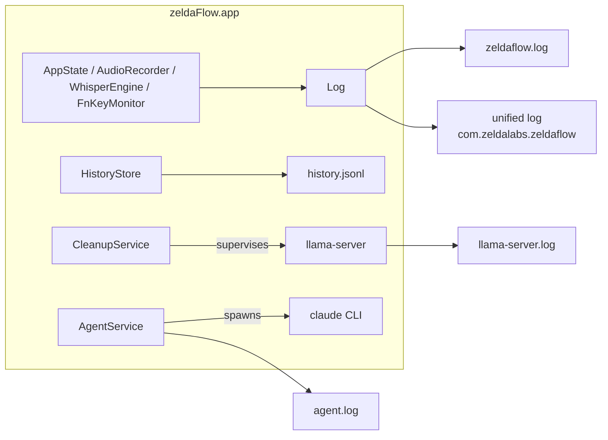

# Observability

zeldaFlow runs as a background accessory app, so when something goes wrong there is no console staring back at you. Everything it does is instead written to a handful of files under:

```
~/Library/Application Support/zeldaFlow/
```

| File | What it is | Written by | Rotation |
|---|---|---|---|
| `zeldaflow.log` | The app's own log — every session, error, and diagnostic | `Log` (Sources/zeldaFlow/Support/Log.swift) | Rotated to `zeldaflow.log.old` when it passes 5 MB |
| `llama-server.log` | stdout + stderr of the supervised `llama-server` (Gemma) child process | `CleanupService` | None — appended forever |
| `agent.log` | Redacted audit trail of Claude Code CLI runs (prompt prefix + narrative; tool results deliberately omitted) | `AgentService` | None — appended forever |
| `history.jsonl` | Every dictation and command run, one JSON object per line | `HistoryStore` | None — append-only |

The same directory also holds `models/` (whisper, Silero VAD, Gemma) and `llama-server.pid`.



## zeldaflow.log

Format — timestamp, level, message:

```
2026-07-28 19:46:51.123 INFO  bootstrap: whisper ready
2026-07-28 19:46:52.410 ERROR CleanupService: llama-server exited (code 9)
```

- Timestamps are local time, `yyyy-MM-dd HH:mm:ss.SSS`.
- Levels are `INFO` and `ERROR` only.
- **Rotation** (verified in `Log.swift`): when the file is over 5 MB at append time, it is *moved* to `zeldaflow.log.old` (replacing any previous `.old`) and a fresh `zeldaflow.log` is started. Rotate-not-truncate is deliberate — the tail of a long session is exactly what post-hoc debugging needs. Worst-case disk footprint is therefore ~10 MB.
- Every message is also mirrored to the macOS unified log (subsystem `com.zeldalabs.zeldaflow`, category `app`) with `privacy: .private` — Console.app shows message bodies as `<private>` because log lines can contain your spoken words. The file log keeps the full text, locally.

## history.jsonl

Append-only JSONL. Each line is one `HistoryEntry` (see `Sources/zeldaFlow/Support/HistoryStore.swift`):

```json
{"id":"5B21…","date":"2026-07-28T09:46:51Z","rawText":"open safari …","finalText":"Open Safari …","appName":"Notes","audioSeconds":3.08,"transcribeMs":918,"cleanupMs":163}
```

| Field | Type | Meaning |
|---|---|---|
| `id` | UUID string | Entry identity |
| `date` | ISO 8601 string | When the session finished |
| `rawText` | string | Whisper output after the final hallucination scrub. Command runs are stored with a `"⌘ "` prefix |
| `finalText` | string | Text actually inserted (after cleanup + replacements). For command runs: the action summaries, joined with `" · "` |
| `appName` | string | The app the text was pasted into (or that was frontmost for a command) |
| `audioSeconds` | number | Captured audio length |
| `transcribeMs` | int | Whisper wall time |
| `cleanupMs` | int | Gemma cleanup wall time (0 when cleanup is Off/Light or skipped); for command runs this holds the LLM interpretation time |

The Hub's History page shows the most recent 500 entries; **Clear All** there deletes the file.

## Tailing logs live

```sh
tail -f ~/Library/Application\ Support/zeldaFlow/zeldaflow.log
```

All three logs at once:

```sh
tail -f ~/Library/Application\ Support/zeldaFlow/{zeldaFlow,llama-server,agent}.log
```

The unified log works too, but message bodies are redacted there:

```sh
log stream --predicate 'subsystem == "com.zeldalabs.zeldaflow"'
```

## What a healthy dictation session looks like

At launch (async lines can interleave; the whisper load and llama-server start run in parallel):

```
INFO  zeldaFlow launching (bundle: /Applications/zeldaFlow.app)
INFO  HotkeyMonitor: event tap installed on its own run loop
INFO  WhisperEngine: model loaded (…/models/ggml-large-v3-turbo-q8_0.bin)
INFO  bootstrap: whisper ready
INFO  CleanupService: launched llama-server pid 4711
INFO  CleanupService: ready on :8765
```

Then, for each hold-Fn dictation:

```
INFO  AudioRecorder: capturing "MacBook Pro Microphone" (48000 Hz, 1 ch)
INFO  ScreenContext: WhisperEngine, sessionGeneration, manu@example.com
INFO  CleanupService: cleaned 63→59 chars in 163 ms
INFO  session: 3.1s audio, stt 918ms, cleanup 163ms, 59 chars, insert=pasted
```

Line by line:

1. **`AudioRecorder: capturing "<device>" (<rate> Hz, <ch> ch)`** — the engine started and names the system default input device. If a recording turns out silent, *which device delivered it* is the whole story, so it's logged up front. A multichannel count (e.g. `9 ch`) is normal with voice processing on — the converter maps channel 0 explicitly.
2. **`ScreenContext: <terms>`** — the on-screen terms harvested from the frontmost window to bias Whisper's prompt. Only appears when the harvest found terms and the Settings toggle is on (see [Privacy](#privacy)).
3. **`CleanupService: cleaned A→B chars in N ms`** — Gemma cleanup ran (only in Full mode, above the minimum word count).
4. **`session: Xs audio, stt Yms, cleanup Zms, N chars, insert=pasted`** — the summary line: audio length, whisper wall time, cleanup wall time, final character count, and the insert result. `insert=leftOnClipboard(…)` means the paste was refused (focus moved, or a password field was active) and the text is waiting on your clipboard — a preceding `insert blocked (…)` line names the target and actual frontmost app.

For scale: on an Apple M4 Pro (24 GB), measured with `--selftest` on 2026-07-28, a 3.08 s clip transcribes in ~920–1020 ms with cleanup at ~160–360 ms; model load + warm-up is ~750 ms; a 48 s clip transcribes in ~1.5 s.

Command sessions (triple-tap) log their own trail instead:

```
INFO  command: "open safari" (front: Notes)
INFO  command fastpath → open_app
```

(`command → …` instead of `fastpath` when the local LLM did the interpreting.)

## New diagnostic lines (and what each means)

These were added specifically because the failures they mark used to be invisible:

| Line | Level | Meaning |
|---|---|---|
| `AudioRecorder: capturing "<device>" (<rate> Hz, <n> ch)` | INFO | Logged at every session start. If this ever names a display's HDMI audio or a virtual device (Teams/Zoom mic), your next symptom is explained before it happens. |
| `AudioRecorder: N samples captured but peak level ≈ 0 — "<device>" delivered silence (did the default mic change?)` | ERROR | The capture ran but heard nothing (peak < 0.001). The default input is a silent device — the classic docked-monitor failure, previously an invisible one. |
| `AudioRecorder: engine reset after idle-time audio device change` | INFO | The audio topology changed while zeldaFlow was idle (dock plugged in, monitor USB audio appeared, default mic switched). The prepared engine graph may reference a device that's gone, so the next `start()` rebuilt it instead of capturing silence from a dead graph. This line is the *recovery working*, not an error. |
| `session discarded: X.XXs of audio (below 0.35s minimum)` | INFO | A held Fn yielded (near) zero audio. Either a genuinely brief tap — or a silent input device / dead engine graph. It used to vanish without a trace; now it leaves evidence. Repeated occurrences alongside the "delivered silence" line mean the mic, not you. |
| `whisper: Core ML encoder not installed — encoder runs on Metal (scripts/setup.sh downloads the Neural Engine version)` | INFO | One-time hint. whisper.cpp reports the missing Core ML ANE encoder at error level on *every* model load and then falls back to the Metal GPU encoder; zeldaFlow notes it once as a setup hint instead of logging a scary error per launch. |
| `whisper: Core ML encoder present at <path> but failed to load — possibly a partial install; delete it and re-run scripts/setup.sh (using Metal meanwhile)` | ERROR | The `.mlmodelc` exists on disk but whisper couldn't load it — a corrupt or partial install (the "not installed" case above is only a hint; this one is a real error). Logged once per launch; the Metal encoder carries on in the meantime. |

## Failure signatures

| Symptom | Log line to look for | Cause | Fix |
|---|---|---|---|
| Dictation silently produces nothing after docking / plugging in a monitor | `AudioRecorder: … peak level ≈ 0 — "<device>" delivered silence` (and `capturing "<device>"` naming an HDMI/virtual device) | macOS switched the default input to a silent device (monitor HDMI audio, a virtual conferencing mic) | Pick your real mic in System Settings → Sound → Input. zeldaFlow rebuilds its engine on the next session (`engine reset after idle-time audio device change`). |
| Fn does nothing; the emoji picker appears instead | `FnKeyMonitor: tapCreate failed (Accessibility not granted?)` | Accessibility permission missing or revoked — an ad-hoc-signed rebuild changes the code signature and silently resets the TCC grant | Re-grant zeldaFlow in System Settings → Privacy & Security → Accessibility. The watchdog installs the tap automatically once granted (`tap installed after Accessibility grant`). For development, sign with the stable `zeldaFlow Dev` cert (`scripts/make-cert.sh`) so grants survive rebuilds. |
| Nothing ever transcribes; menu shows a setup problem | `bootstrap: whisper model missing` | `ggml-large-v3-turbo-q8_0.bin` is not in `…/zeldaFlow/models/` | Run `scripts/setup.sh`. |
| Cleanup stopped working / voice commands fail; raw text still inserts | `CleanupService: llama-server exited (code N)` | The Gemma sidecar crashed. Code 9 is a SIGKILL — usually memory pressure. zeldaFlow restarts it up to 3 times with backoff, then gives up until relaunch | Check the tail of `llama-server.log` for the server's own error. Make sure llama.cpp is installed (`brew install llama.cpp`). Dictation is unaffected — cleanup always falls back to the raw transcript. |
| Transcription works but feels slower than it should; GPU busy | `whisper: Core ML encoder not installed — …` (once per launch) | The Core ML ANE encoder (`.mlmodelc`) isn't installed, so the whisper encoder runs on the Metal GPU instead of the Neural Engine | Run `scripts/setup.sh` to download the Neural Engine version. |
| Recording aborts mid-sentence with "Microphone changed — try again" | `mic configuration changed mid-recording` | The input device changed while recording (AirPods connected, interface unplugged) — the engine graph is dead. With ≥ 1 s captured, zeldaFlow finishes with what it has instead | Just dictate again; the next session uses the new device. |
| You held Fn, spoke, and the pill snapped back to idle with no output | `session discarded: X.XXs of audio` | Near-zero audio reached the recorder | If it recurs, read the adjacent `capturing "<device>"` / `delivered silence` lines — this is the downstream symptom of a silent input device. |

## Privacy

Everything above is local. Specifically:

- **Transcripts never leave the Mac.** Raw and final text live only in `history.jsonl` in Application Support. Delete them any time with **Clear All** on the Hub's History page, or by deleting the file.
- **`zeldaflow.log` can contain your words** — command transcripts, typed commands, and harvested on-screen terms are logged for debugging. The unified-log mirror redacts all message bodies (`<private>`); the readable copy exists only in the local file, which rotates away at ~10 MB total.
- **Screen-context terms are logged.** When "Local Deep Context" harvests terms from the frontmost window, the chosen terms appear as a `ScreenContext: …` line. To turn the feature (and its logging) off: **Hub → Settings → "Screen-aware accuracy (reads on-screen names locally)"**. Harvested text is session-scoped either way — it biases one dictation and is discarded when the session ends.
- `llama-server.log` contains whatever the server prints; `agent.log` keeps a redacted narrative — tool results (screenshots, command output) are never persisted. The agent log only exists if you've enabled the (opt-out, Fn-gated) Claude agent mode — the one deliberate exception to fully-local, per zeldaLabs' design rules for zeldaFlow.
