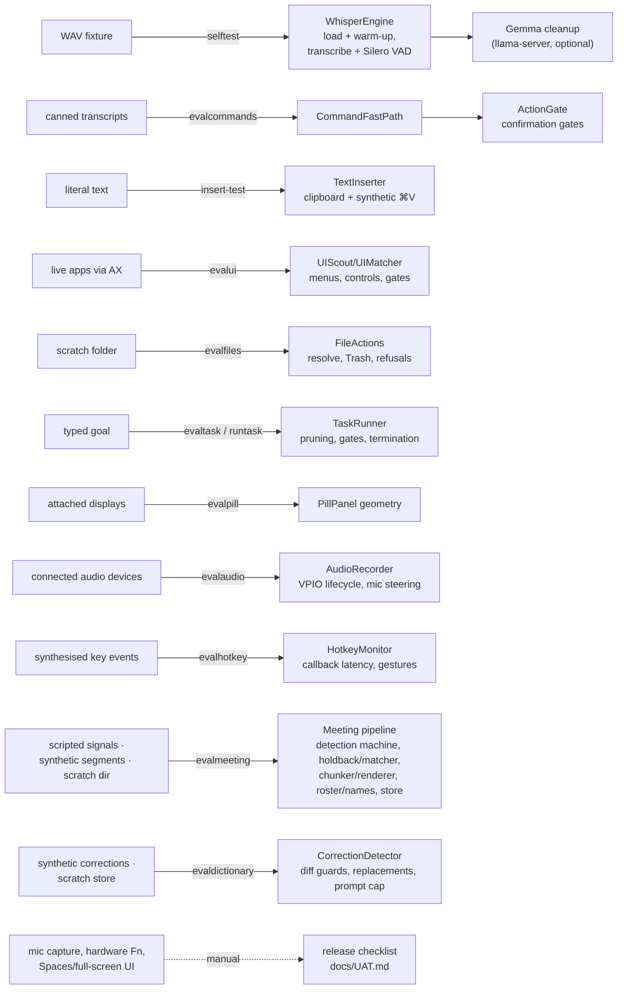

# Testing zeldaFlow

zeldaFlow's test strategy is shaped by what the app is: a thin deterministic
core (audio decode, command parsing, confirmation gates) wrapped around
things that are inherently hard to automate (a hardware Fn key, TCC
permission prompts, AppleScript control of real apps, local LLM output).
The deterministic core is pinned by headless harnesses **built into the
binary itself** — no test framework, no network, runnable on any machine.
Everything OS-integration-shaped is covered by a ~20-minute manual
checklist: [docs/UAT.md](UAT.md).

Build first (note: `swift build` is broken on the beta CLT this project is
developed on — `scripts/build-app.sh` is the supported build path, see the
README's toolchain notes):

```bash
scripts/build-app.sh
BIN=./build/zeldaFlow.app/Contents/MacOS/zeldaFlow
```

What each harness covers in the real pipeline:



## 1. Self test — `zeldaFlow --selftest [wav]`

End-to-end pipeline check without a microphone or any UI:

```bash
"$BIN" --selftest path/to/clip.wav
```

What runs, in order:

1. **Model presence** — prints the resolved paths for the whisper model
   (required), the Silero VAD model (optional), and the Gemma cleanup model
   (optional), each marked `found`/`missing`.
2. **Model load + warm-up** — `WhisperEngine.loadAndWarmUp()` loads
   large-v3-turbo-q8_0 (Metal) and decodes one second of quiet noise so the
   timing you see includes Metal graph compilation, exactly like the app's
   first real dictation. With **no WAV argument** the self test stops here —
   a fast smoke check that the vendored framework and model file are healthy.
3. **Transcription** — the WAV is decoded via AVFoundation and converted to
   16 kHz mono Float32 (any AVFoundation-readable file works), then
   transcribed with your configured language and dictionary prompt, with the
   Silero VAD pre-filter when the VAD model is present. Printed as `RAW:`.
4. **Gemma cleanup** — a `CleanupService` is started against llama-server
   and polled up to 90 s for readiness. If it becomes ready, the transcript
   is cleaned and printed as `CLEANED:`; if llama.cpp isn't installed or the
   server never comes up, cleanup is **skipped, not failed** — dictation
   without cleanup is a supported configuration.

Exit codes:

| Code | Meaning |
|------|---------|
| `0`  | Pipeline OK (including "cleanup unavailable — skipped") |
| `1`  | Whisper model missing (`scripts/setup.sh` not run) |
| `2`  | Transcript came back empty |
| `3`  | Model load or transcription threw an error |

No TCC permissions are needed: input is a file, so `--selftest` runs
headless on a fresh machine or in a sandbox.

### Generating test WAVs

macOS can synthesize fixtures with `say` and convert them with `afconvert`:

```bash
say -o /tmp/clip.aiff "Open Safari and search for the weather in Melbourne today."
afconvert -f WAVE -d LEI16@16000 -c 1 /tmp/clip.aiff /tmp/clip.wav
"$BIN" --selftest /tmp/clip.wav
```

The `afconvert` step targets 16 kHz mono Int16 — the self test converts any
readable format itself, but this matches what the engine consumes and keeps
fixtures small. Synthesized speech transcribes reliably; keep clips at
least ~1 s long. For longer fixtures, put the text in a file and use
`say -o long.aiff -f long.txt`.

## 2. Command evals — `zeldaFlow --evalcommands`

```bash
"$BIN" --evalcommands   # prints one line per pin; exit 0 iff all hold
```

Deterministic behavior pins for the voice-command layer
(`Sources/zeldaFlow/Support/CommandEvals.swift`): the fast-path parser and the
confirmation gates. **No LLM, no network, no permissions** — it runs in
under a second on any machine, so it can gate a release: if one pin fails, a
command people rely on changed meaning. Re-run after any change to
`CommandFastPath`, `ActionGate`, `MusicPlayers`, or `AppResolver` (see also
[evals/commands.md](../evals/commands.md)).

The 40 pins, by group:

**Must-execute (7)** — exact-word commands the fast path owns outright, so a
small model can never substitute an app, artist, or destination:

| Pin | Asserts |
|-----|---------|
| `open safari` | parses to `open_app` with app `Safari` |
| wake words stripped | `"hey zeldaFlow can you please open safari"` parses identically — wake words and courtesy fluff are removed before matching |
| `open spotify` | `open_app` when installed on this Mac, else `open_url` to the web player (device-adaptive, never a different local app) |
| `pause the music` | `music_control` / `pause` |
| `next track` | `music_control` / `next` |
| `set the volume to 40` | `set_volume` with level `40` |
| `mute` | `set_volume` with `mute` |

**Music routing (4)** — names copied verbatim, a service only when spoken:

| Pin | Asserts |
|-----|---------|
| `play blinding lights by the weeknd` | `play_music` with song *Blinding Lights*, artist *The Weeknd*, and **no service guessed** |
| named service reaches the action | `"…on spotify"` carries `service: spotify` through |
| apple music by name | `"…on apple music"` carries `service: apple music` |
| `play my gym playlist` | `play_music` with playlist *Gym* |

**Navigation, questions, edit (4):**

| Pin | Asserts |
|-----|---------|
| `navigate to the airport` | `navigate`, transport `drive` |
| `walk me to the station` | `navigate`, transport `walk` |
| `what's the weather in paris` | routes to `web_answer` |
| `make this shorter` | routes to `edit_text` (Speak-to-Edit) |

**Must-defer (3)** — ambiguity belongs to the LLM; the fast path must return
`nil` rather than guess:

| Pin | Asserts |
|-----|---------|
| multi-intent | `"open notes and play some jazz"` is not fast-pathed |
| messaging | `"text sarah i'm on my way"` is not fast-pathed (free-form content) |
| `close the tab` | is **not** `close_app` — a UI-level phrase, not an app quit |

**Confirmation gates (5)** — the layer around anything that leaves this Mac:

| Pin | Asserts |
|-----|---------|
| `send_email` gated | a confirmation label is produced when confirm-before-send is on |
| `send_email` ungated when off | the user's toggle is honored |
| `draft_email` never gated | drafts send nothing, so no gate |
| `send_message` gated | iMessage sends confirm like email |
| `agent_task` **always** gated | `ActionGate.alwaysConfirmLabel` fires regardless of any setting — a background agent gets terminal access, and that gate is deliberately non-configurable |

**Prompt-echo scrub, dictation (5)** — `HallucinationFilter.scrubFinal`. The
decoder is given a glossary as its initial prompt; on near-silence it sometimes
recites that prompt back instead of transcribing. None of it may reach the
cursor (ADR 22, ADR 8):

| Pin | Asserts |
|-----|---------|
| bare `"Glossary."` echo dropped | a lone prompt recitation scrubs to empty |
| repetition loop collapses | a decoder stuck repeating one phrase collapses to one copy |
| emphatic repetition capped, not erased | "no no no" is real speech — capped, never deleted |
| real dictation survives byte-identical | the filter is not allowed to touch honest text |
| a genuine spoken glossary keeps its words | saying "glossary" out loud still transcribes |

**Prompt-echo scrub, command mode (3)** — `scrubMeetingSystem`. Command mode
*executes* what it hears rather than pasting it, so an echo here is worse than
a typo:

| Pin | Asserts |
|-----|---------|
| one-word glossary echo dropped | `"Glossary, Manushresth."` scrubs to empty |
| a real command survives | `"Open Safari."` is untouched |
| a command naming a glossary word survives | the word appearing in a real command is not a reason to drop it |

**Glossary-echo field cases (9)** — each pin is a real failure caught on a live
call, kept as a regression:

| Pin | Asserts |
|-----|---------|
| misspelled glossary loop dropped | the decoder mangling its own prompt is still an echo |
| scaffold-less recitation with a repeat dropped | no "Glossary:" prefix needed to recognise one |
| a single glossary mention is kept | one mention could be real speech — not enough to drop |
| intra-sentence word loop capped | the loop is capped, the surrounding real words survive |
| truncated echo dropped ("Zelda" ≈ zeldaFlow) | round two of the same bug — partial words count |
| bare punctuation drops to empty | `"."` is not a transcript |
| meeting system scrub drops bare punctuation | same rule on the system channel |
| far-side decode carries no prompt at all | stronger than scrubbing: the other party's audio is decoded with **no** glossary, so there is nothing to echo (ADR 29) |
| the user's own channel keeps its glossary | the biasing that makes your own names accurate is not lost |

## 3. Insert test — `zeldaFlow --insert-test "text"`

```bash
"$BIN" --insert-test "hello from zeldaFlow"   # 3 s to click into a target field
```

Waits 3 seconds (click into a text field somewhere), then runs the
production `TextInserter` path: pasteboard snapshot → transient-marked
clipboard write → synthetic ⌘V → clipboard restore. Prints
`insert result: …` (the result is printed, not encoded in the exit code).
This is the one CLI mode that needs a TCC grant — Accessibility, for the
synthetic keystroke — so it cannot run headless; use it to verify insertion
into a specific problem app (Electron editors, terminals).

## 4. Action evals — `zeldaFlow --evalactions`

```bash
"$BIN" --evalactions
```

Live-fire UAT of the app-control actions: where `--evalcommands` pins the
parser without side effects, this mode **executes real actions on the Mac
it runs on** and verifies their observable results — then puts everything
back. Current steps: `open_app`/`close_app` (TextEdit, verified via the
process list), `set_volume` level + mute (read back via AppleScript, the
starting volume is snapshotted first and restored last), `create_note` and
`add_reminder` (created with a unique `zeldaFlow-UAT-<timestamp>` marker,
verified present, deleted, verified gone), `navigate` (Apple Maps opens
with the route; Maps is quit again if the test launched it), and
`music_control` play/pause (only if nothing is already audibly playing,
at 12% volume, briefly).

Safety rules baked in: apps that were already running are never quit;
actions that reach another person (`send_email`, `send_message`) or a
terminal (`agent_task`) are never run — they stay behind the live Fn
confirmation gate; a missing Automation permission reports as `skip`, not
failure. Exit code 0 when nothing failed. Because it needs Automation
grants and a logged-in session, this mode is for a real Mac, not CI.

## 5. Noise-robustness guard — `evals/noise-robustness.py`

```bash
python3 evals/noise-robustness.py     # requires sox; exit 0 = within budget
```

Renders one synthesized sentence at several signal-to-noise ratios, runs
each through `--selftest`, and fails if word error rate degrades past a
committed budget.

**This is a tripwire, not a measurement.** Its only job is to catch a
*regression* — a model swap, a VAD parameter change, an edit to the initial
prompt — that quietly makes zeldaFlow worse in noise. The numbers it prints
must never be quoted as product accuracy claims, because:

- the speech is synthesized, so it is perfectly articulated and carries no
  [Lombard effect](https://en.wikipedia.org/wiki/Lombard_effect) (people
  involuntarily change their voice in noise and at distance);
- the noise is synthetic and stationary, unlike a real room;
- the entire microphone path is bypassed — macOS input gain, the MacBook
  mic array, and Apple's voice-processing mode never run.

Real-world behavior is measured by the microphone-path session in
[docs/UAT.md](UAT.md) §10, with a human and an actual room. Where the two
disagree, the room wins.

## 6. Performance benchmarking

Methodology and current numbers live in [docs/PERFORMANCE.md](PERFORMANCE.md).
In short: fixed `say`-synthesized WAV fixtures (short ~3 s, medium ~20 s,
long ~48 s, plus varied-prose long-form clips of 2.5, 6.2, and 12.3
minutes), each run as a cold-start `--selftest` so load + warm-up,
transcription, and cleanup are timed separately; the short clip is run 3×
for variance; peak RSS is sampled from `ps -o rss=` every 0.5 s for the
process lifetime; `--evalcommands` runs at the end of every benchmark.

Headline from the 2026-07-28 runs (Apple M4 Pro, 24 GB): a 3 s clip
transcribes in ~0.9–1.0 s, a 48 s clip in ~1.5 s, a 12.3-minute dictation
in ~18 s (~40× real time), peak RSS ≈ 1.1–1.25 GB, and all command pins
held — full tables in [PERFORMANCE.md](PERFORMANCE.md). The 12.3-minute
run caught a real bug (cleanup truncating past its context window — fixed
same day; see PERFORMANCE.md's long-form section), which is exactly the
kind of failure this tier exists to catch.

## 7. UI-control evals — `zeldaFlow --evalui`

```bash
"$BIN" --evalui    # needs Accessibility; drives TextEdit + surveys running apps
```

Live proof of the "control any app through its own UI" path (ADR 23), in
five parts: menu discovery and phrase matching against TextEdit, a real
`AXPress` on `Format ▸ Font ▸ Bold`, window-control enumeration in the Open
panel (click Cancel, type into the document), the destructive/purchase
gates ("Get"/"Buy"/"Delete" gated; "Get Info"/"Cancel" free), and the focus
guard (an action bound to Xcode while TextEdit is frontmost must refuse).
Then breadth: every running app's command tree is enumerated, and a
self-match sweep feeds each app's own command names back through the
matcher — 444/444 across 10 apps on the reference machine. A skipped app
(not running) is reported, never failed.

## 8. File-action evals — `zeldaFlow --evalfiles`

```bash
"$BIN" --evalfiles   # creates and trashes a scratch folder in ~/Downloads
```

The refusals matter more than the happy path: spoken-path resolution must
confine itself to `~` (`/System/...` and `../` escapes refuse), deletes go
to the Trash and never `unlink`, standard folders themselves are protected,
and the delete confirmation shows the *resolved* path. The happy path
(create/move/list/reveal) runs against a real scratch folder and cleans up.

## 9. Task-loop evals — `zeldaFlow --evaltask` and `--runtask`

```bash
"$BIN" --evaltask                                  # safety + termination, no model needed
"$BIN" --runtask "download Slack from the App Store"   # live, confirmations auto-declined
```

`--evaltask` pins everything ADR 24 promises without needing the model:
task-vs-command intent, candidate pruning (succeeded/twice-failed/echo
options withheld), the purchase gates, and termination — a dead planner
stops in under a second, cancellation is honoured immediately. If the local
model is up it also reports live selection quality as a signal, not a gate.
`--runtask` drives one real task on the live screen with every confirmation
auto-declined, so the money path can be walked to the Get button and proven
to stop there without ever buying anything.

## 10. Pill-position evals — `zeldaFlow --evalpill`

```bash
"$BIN" --evalpill    # measures real frames on every attached display
```

Asserts the pill's geometry rules (ADR 4/18/25) against the actual display
arrangement: centred within half a point through every phase transition,
display-sticky, unmoved by `orderFront`/`makeKey` (the AppKit-constrain
suspicion is pinned false), recovery when its display disappears, symmetric
type-bar growth, and a resting height consistent across displays (≥ 40 pt
off the glass everywhere, spread < 40 pt) so a Dock-less external monitor
no longer pins it to the bottom edge.

The meeting-layout rows (ADR 27) are pinned here too: every
meeting-driven transition uses `.keep` — a meeting starting must never
move the pill to another display — and the meeting chip stays visible
even with the idle pill switched off, because consent visibility outranks
that preference.

## 11. Audio-seamlessness evals — `zeldaFlow --evalaudio`

```bash
"$BIN" --evalaudio   # topology-aware; needs a real input device
```

Asserts ADR 26 for whatever is actually connected: on Bluetooth headphones,
voice mode must never engage and the Bluetooth mic must never be opened
(capture lands on the built-in mic); on speakers, voice processing engages
with ducking at minimum, stays warm across back-to-back recordings, and
releases after the (injected) idle delay. With echo cancellation off it
must never engage at all. The measured cold/warm numbers (1409 ms vs 28 ms)
are printed so a regression in either direction is visible.

## 12. Hotkey-latency evals — `zeldaFlow --evalhotkey`

```bash
"$BIN" --evalhotkey   # no permissions needed; the real tap is never installed
```

Asserts ADR 28. The first check is the one that matters: it blocks the main
thread outright for 500 ms and times the tap callback anyway — measured
0.012 ms blocked against 0.007 ms free, because main is no longer on the
keystroke path at all. Under the old design that measurement *was* the block
duration, by construction, which is what made the hotkey feel laggy and drop
the second press. Sustained input is measured too (200 events, mean
0.001 ms), and the gestures built on the state machine are pinned: hold →
push-to-talk, lone tap → discard, double-tap → hands-free, triple-tap →
command mode, a failed start leaving nothing armed, the bound key never
leaking to macOS, Esc swallowed only when there is something to cancel,
fn+arrow dirtying the session, and a suspended tap standing down while
Settings records a new binding.

Events are synthesised and handed to the callback directly, so this needs no
Accessibility grant and never touches the user's keyboard — it covers the
callback and the state machine, not the hardware Fn press.

## 13. Meeting evals — `zeldaFlow --evalmeeting`

```bash
"$BIN" --evalmeeting   # pure pins + scripted machine on any Mac; live checks skip without their grants
```

Three tiers in one run, covering ADRs 27/29/30/31/32/33/34/38:

- **Pure pins — no permissions, no clock.** The deterministic core of the
  meeting pipeline, all of it written time-injected for exactly this:
  `TranscriptMatcher` overlap and merged-candidate behavior,
  `MicHoldback` queue/flush/retraction — including the committedAt race,
  driven with injected clocks so both retract-window clauses are
  exercised — the transcriber's silence and system-dominant bleed gates,
  the notes chunker (segment-boundary, speaker-turn preference), the
  deterministic merge + renderer (owner upgrade, empty-section omission),
  `MeetingStore` fold/compaction/orphan detection against a scratch
  directory instead of the live Application Support tree, and the
  `SpeakerDiarizer` alignment pins (ADR 31: overlap voting under timestamp
  drift, unattributable-stays-Them, mic-never-assigned, and the
  transcriptHash-stable-across-annotation invariant that keeps notes from
  going stale). The speaker-attributed notes layer (ADR 38) pins the
  roster (precedence, de-collision, key round-trips), the labeled
  transcript builder never moving the hash, the speaker-handoff chunk
  break, the dynamic owner-enum grammar, the name-inference acceptance
  gate (evidence-backed only, stoplist, no duplicate assignment), the
  exact render fixture with bolded owners, rename re-render determinism
  ("You" never free-text replaced), and notes.json / pre-ADR-38 meta
  decode compatibility.
- **Scripted detection machine.** `MeetingDetectionEngine` is driven
  through `handle()` with a scripted `now()` and shrunk thresholds, so
  the whole state machine runs in ~2 s of wall time: tier-1 and tier-2
  starts, browser corroboration + the exhausted-holder latch, FaceTime
  gating, the WhatsApp input+output dwell (ADR 33: voice notes never fire,
  output blips reset the clock, tier-2 never trusts WhatsApp), dictation
  suppression and the post-dictation replay, the 30 s mic-idle / 5 s
  app-quit / 4 h-cap stop paths, and both cooldowns.
  Also the ADR 34 chunking pins: cuts land inside pauses, a pause before the
  minimum never cuts early, an unbroken talker is force-cut at the maximum on
  the quietest frame, and a sentence inside a mostly-silent window survives
  the gates (the whole-chunk-average regression that deleted real speech).
- **Optional live checks.** A real `SystemAudioTap` start/stop (needs the
  system-audio TCC grant), a whisper pass over a synthesized two-channel
  fixture (needs the model installed), an offline-diarizer smoke over
  a synthetic 30 s clip (needs the ADR 31 models from `scripts/setup.sh`;
  point `ZF_DIARIZER_FIXTURE` at a real two-speaker 16 kHz mono WAV for
  the strict variant), and the ADR 34 chunking A/B — the same speech through
  the same whisper, cut the old blind-5 s way and the new pause-aligned way,
  pinning that the new one never captures fewer words:

  ```bash
  say -v Samantha --data-format=LEI16@16000 -o /tmp/speech.wav "…a long paragraph…"
  ZF_SPEECH_FIXTURE=/tmp/speech.wav "$BIN" --evalmeeting
  ```

  Each reports `skip`, not failure, so the deterministic tiers still gate a
  release on any machine.

## 14. Dictionary evals — `zeldaFlow --evaldictionary`

```bash
"$BIN" --evaldictionary   # pure pins — no LLM, no AX, no permissions; runs in CI
```

Pins the learn-from-corrections loop (ADR 0037), all deterministic:

- **Correction detector.** The happy paths (a retype inside a larger field,
  a respelled name, a case-only recapitalization, detection surviving text
  typed after the paste) and every fail-closed guard: unchanged text, empty
  or unrelated fields, sub-4-word inserts, region rewrites, and the privacy
  bound — a span that grew past the inserted text is never diffed.
- **Similarity gate.** Content edits rejected ("tomorrow" → "Friday",
  "cat" → "hat"); respellings accepted ("kubcon" → "KubeCon",
  "sindy" → "Cindy", "github" → "GitHub").
- **Correction records.** Count bumping, permanent case-insensitive pair
  dismissal, dismissal surviving reload, and a pre-0037
  `learned-words.json` still decoding — against a scratch store.
- **Glossary guardrails.** The distinctiveness bar (short/common words stay
  replacement-only), the 40-word prompt cap, and the one interaction that
  could silently eat speech: with a learned word in the prompt,
  `HallucinationFilter.scrubFinal` must keep a legitimate sentence using it
  while still scrubbing glossary recitations and looped echoes.
- **Replacement engine.** Case-insensitive whole-word mapping pinned
  ("Coupon" maps, "coupons" survives).

## 15. What is not automated, and why

| Area | Why it's manual |
|------|-----------------|
| A hardware Fn press | `--evalhotkey` covers the callback's latency and every gesture the state machine builds, but the suppressing CGEventTap exists to intercept a **hardware** Fn press below the system, and synthetic events don't exercise that path (Fn proved impossible to synthesize during demo automation). Installing the real tap also needs an Accessibility grant. |
| Anything TCC-gated | Microphone, Accessibility (tap + synthetic ⌘V), per-app Automation prompts, Screen Recording. Grants are interactive and keyed to the code signature — ad-hoc rebuilds silently lose them (see the README's signing caveat) — so no CI environment can hold them. |
| Live mic capture and audio-device changes | `--evalaudio` covers the voice-processing lifecycle and device-steering rules on whatever is connected; what remains manual is *hearing* it — profile flips and ducking are judged by ear — and physically changing the topology (dock/undock, headset on/off) mid-session. |
| UI behavior | `--evalpill` measures pill geometry on the attached displays; what remains manual is Spaces/full-screen behavior, the non-activating type-bar focus dance, Hub, and onboarding — visual and windowing behavior beyond frame arithmetic. |
| Action execution against personal data | `--evalactions` covers the safe, reversible subset live (apps, volume, note, reminder, Maps, music transport). Mail/Messages/Calendar/Contacts actions still need a human: they touch real accounts and recipients, and their confirmation gates are deliberately interactive. |
| LLM output quality | Gemma cleanup and command interpretation are model output. What's pinned instead is the deterministic shell around the model: the fast path that pre-empts it, the gates that bound it, and cleanup's fall-back-to-raw sanity checks. |
| Agent mode | Requires an installed, signed-in Claude Code CLI — the one deliberately non-local capability. |

Every row above is exercised by the manual release checklist:
**[docs/UAT.md](UAT.md)** (~20 minutes on a real Mac, including a dedicated
multi-monitor section).
